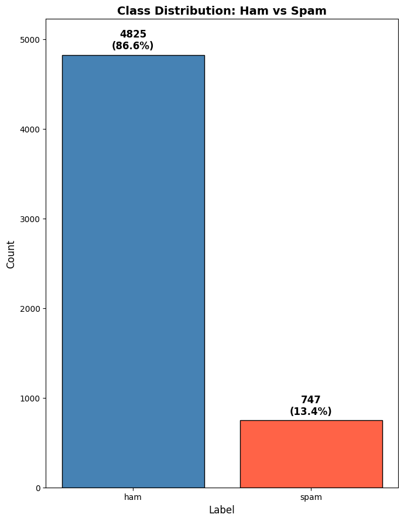
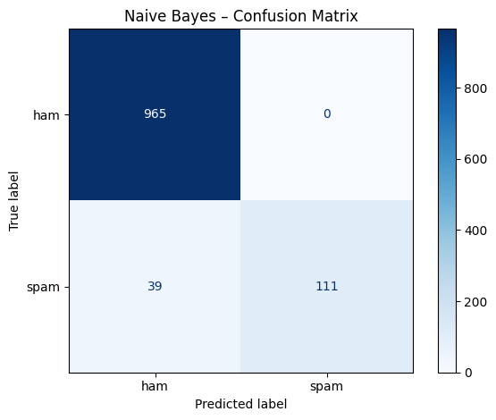
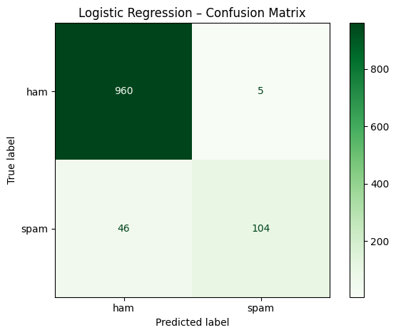
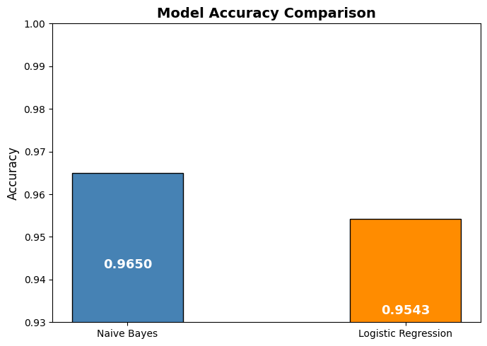

# Lab-Assignment-4-NLP
## Topic: Spam Message Classification using Machine Learning

---

## Course Details

Course: Natural Language Processing  
Assignment: Lab Assignment 4  
Selected Problem Statement: SMS Spam Message Classification  

---

## Group Details

| Student Name | PRN |
|--------------|-------------------|
| Parimal Ahire | 202301040067 |
| Atharva Suryawanshi | 202301040283 |
| Rajveersinh Kher | 202301040233 |
| Mohit Patil | 202301040272 |

---

## Problem Statement

The objective of this assignment is to build an NLP based machine learning model to classify SMS messages as **Spam** or **Ham (Not Spam)**. The system uses text preprocessing, feature extraction, and classification algorithms to perform spam detection.

---

## Objective

The main objectives of this assignment are:

- To understand NLP preprocessing techniques
- To convert text data into numerical features
- To train classification models
- To evaluate model performance
- To compare different machine learning models

---

## Dataset

Dataset Used: SMS Spam Collection Dataset

Dataset contains:
- SMS text messages
- Labels (Spam or Ham)

Dataset Source:  
https://www.kaggle.com/datasets/uciml/sms-spam-collection-dataset

Dataset Description:
- Total messages: ~5500
- Two classes: Spam and Ham
- Real-world SMS data

---

## Project Pipeline

### 1. Data Loading
The dataset is loaded using pandas and basic exploration is performed:

- Checking null values
- Checking class distribution
- Understanding dataset structure

### 2. Text Preprocessing

The following preprocessing steps were performed:

- Lowercase conversion
- Removing punctuation
- Removing stopwords
- Tokenization
- Stemming / Lemmatization
- Removing special characters
- Removing extra spaces

Purpose:
To clean the raw text and improve model performance.

---

### 3. Feature Extraction

TF-IDF Vectorization was used to convert text into numerical vectors.

Why TF-IDF:

- Highlights important words
- Reduces impact of common words
- Improves classification quality

---

### 4. Model Training

The following models were used:

Naive Bayes:
- Fast and efficient
- Works well with text classification
- Simple implementation

Logistic Regression:
- Good accuracy
- Suitable for binary classification
- Handles feature relationships better

---

### 5. Model Evaluation

Models were evaluated using:

- Accuracy
- Precision
- Recall
- F1 Score
- Confusion Matrix

These metrics help measure:

- Correct spam detection
- False detections
- Overall performance

---

## Model Analysis

### Naive Bayes

Strengths:

- Fast training
- Simple algorithm
- Works well for text classification
- Achieved highest accuracy in this experiment

Limitations:

- Assumes word independence
- Cannot capture complex relationships

### Logistic Regression

Strengths:

- Stable predictions
- Good classification performance
- Handles feature relationships

Limitations:

- Slightly lower accuracy than Naive Bayes in this experiment
- Requires good feature extraction

---

## Technologies Used

- Python
- Pandas
- Numpy
- Scikit-learn
- NLTK
- Matplotlib
- Seaborn

---

## Implementation

The complete implementation is provided in the Jupyter Notebook:  
LabAssignment_4_NLP.ipynb

The notebook includes:

- Data preprocessing
- Feature extraction using TF-IDF
- Model training
- Model evaluation
- Result analysis

All outputs are already executed and visible in the notebook.

---

## Results

Model performance comparison shows:

- Naive Bayes Accuracy: 96.50%
- Logistic Regression Accuracy: 95.43%

Observations:

- Naive Bayes performed slightly better on this dataset
- Both models achieved high accuracy
- Traditional ML models perform well for spam detection

---

## Result Visualizations

### Class Distribution

### Confusion Matrix – Naive Bayes

### Confusion Matrix – Logistic Regression

### Model Accuracy Comparison

---

## Learning Outcomes

This assignment helped in understanding:

- NLP preprocessing pipeline
- Text vectorization
- Spam classification techniques
- Model comparison
- Evaluation metrics
- Confusion matrix interpretation

---

## Future Scope

Possible improvements:

- Use Deep Learning models
- Try LSTM or RNN
- Use BERT embeddings
- Hyperparameter tuning
- Deploy as web application
- Use larger datasets

---

## Research Paper Reference

Title: SMS Spam Detection using Machine Learning and Deep Learning Techniques  
Authors: Sridevi Gadde, A. Lakshmanarao, S. Satyanarayana  
Year: 2021  

Citation (IEEE format):

S. Gadde, A. Lakshmanarao and S. Satyanarayana, "SMS Spam Detection using Machine Learning and Deep Learning Techniques," 2021 7th International Conference on Advanced Computing and Communication Systems (ICACCS), 2021, pp. 358–362.

The paper demonstrates the use of machine learning and deep learning techniques such as Naive Bayes, Logistic Regression, SVM and LSTM for SMS spam classification using NLP preprocessing and TF-IDF feature extraction.

---

## Conclusion

This assignment demonstrates the application of NLP techniques for spam detection. After comparing both models, Naive Bayes achieved slightly better accuracy (96.50%) compared to Logistic Regression (95.43%).

The results show that traditional machine learning models can perform effectively on text classification tasks when combined with proper preprocessing and TF-IDF feature extraction.